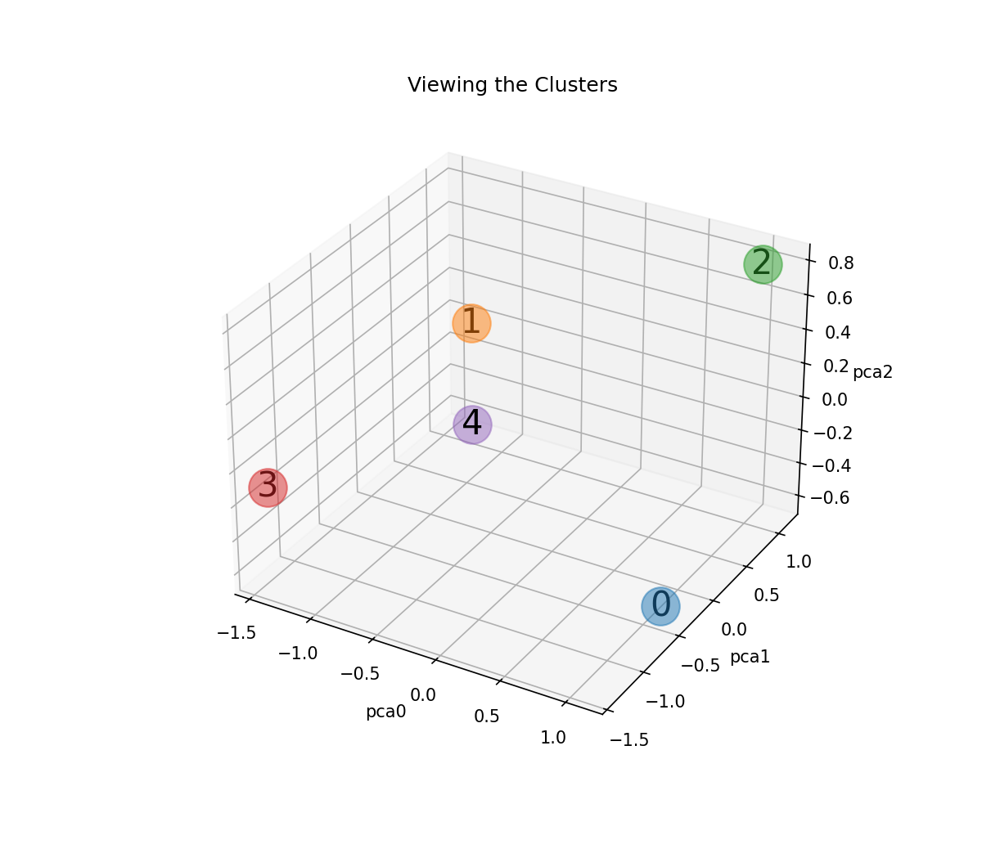
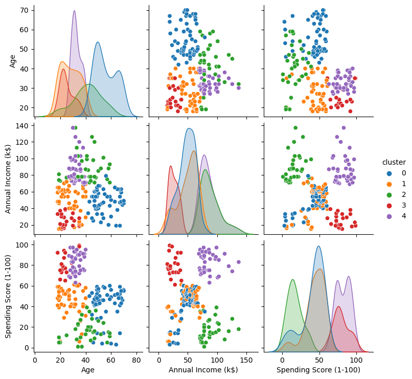
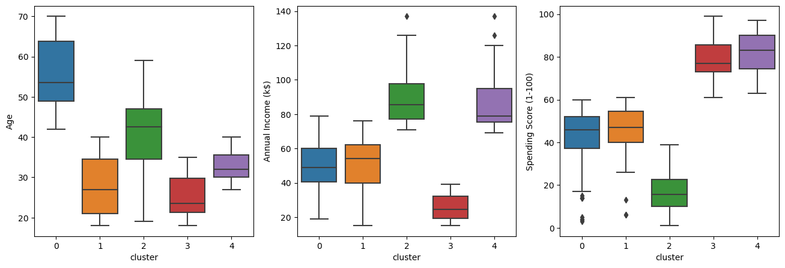

[](https://www.linkedin.com/in/flsbustamante/)
[](https://www.python.org/)

# Segmentação de clientes de um supermercado

Um supermercado, através de cartões de fidelidade, possui alguns dados básicos sobre seus clientes, como idade, gênero, renda anual e pontuação de gastos. Tal pontuação é algo que o supermercado atribui ao cliente com base em parâmetros definidos, como comportamento do cliente e dados de compra. O supermercado deseja entender melhor seus clientes, de modo a formular estratégias de negócios, e para isso contratou um cientista de dados para realizar uma segmentação dos clientes.



[Link original para o dataset](https://www.kaggle.com/vjchoudhary7/customer-segmentation-tutorial-in-python)

Projeto de Segmentação de Clientes, com Clusterização da Base de Dados de um Supermercado utilizando os seguintes pacotes da Linguagem Python: [Pandas](https://pandas.pydata.org/docs/user_guide/index.html), [Matplotlib](https://matplotlib.org/stable/users/index), [Seaborn](https://seaborn.pydata.org/examples/index.html), [Scikit-Learn](https://scikit-learn.org/stable/modules/clustering.html#clustering), etc.

<p align="center"> 
  <a href="https://www.linkedin.com/in/flsbustamante" target="_blank"></a> 
</p>

## Objetivos

O objetivo é segmentar a base de clientes de um supermercado com base em seus dados de compra, fazendo a análise exploratória, realizando o pré-processamento dos dados e utilizando o algoritmo K-Means para realizar a segmentação dos clientes. 

Objetivos detalhados:

- Análise exploratória utilizando o Pandas e o ydata_profiling;
- Comparação dos resultados da clusterização sem e com pré-processamento dos dados, mostrando a importância de se realizar o pré-processamento dos dados;
- Apresentar uma estrutura de projeto de Ciência de Dados, com a utilização de notebooks, scripts, relatórios e repositório no GitHub;
- Apresentar boas práticas de programação em Python, como a utilização de funções e arquivos de script para facilitar o reaproveitamento de código;
- Mostrar boas práticas de uso do SciKit-Learn, como a utilização de pipelines.

## Estrutura do repositório

O repositório está estruturado da seguinte forma:

```
├── dados
├── imagens
├── modelos
├── notebooks
├── reports
├── Scripts
```

- Na pasta `dados` estão os dados utilizados no projeto. O arquivo `Mall_Customers.csv` é o dataset utilizado originalmente. Os demais arquivos são os datasets gerados durante o projeto.
- Na pasta `imagens` estão as imagens utilizadas neste README.
- Na pasta `modelos` estão os modelos gerados durante o projeto. 
- Na pasta `notebooks` estão os notebooks com o desenvolvimento do projeto. Em detalhes, temos:
  - [`projeto_supermercado_01_eda.ipynb`](notebooks/projeto_supermercado_01_eda.ipynb): notebook com a análise exploratória dos dados usando [ydata-profiling](https://github.com/ydataai/ydata-profiling) e Seaborn.
  - `projeto_supermercado_02_clusterizacao.ipynb`: notebook com a clusterização dos dados usando K-Means **sem pré-processamento** (apenas para comparação).
  - `projeto_supermercado_03_clusterizacao_visualizacao.ipynb`: notebook com função para visualização em 3D dos clusters gerados pelo K-Means (sem pré-processamento, somente para comparação).
  - [`projeto_supermercado_04_pipeline.ipynb`](notebooks/projeto_supermercado_04_pipeline.ipynb): notebook com a clusterização dos dados usando K-Means **com pré-processamento** utilizando pipelines do Scikit-Learn.
  - [`projeto_supermercado_05_pipeline_pca.ipynb`](notebooks/projeto_supermercado_05_pipeline_pca.ipynb): notebook com a clusterização dos dados usando K-Means após redução de dimensionalidade com PCA utilizando pipelines do Scikit-Learn.
  - [`funcoes_auxiliares.py`](Scripts/funcoes_auxiliares.py) arquivo com as funções auxiliares utilizadas.
- Na pasta `reports` estão os relatórios gerados durante o projeto utilizando a biblioteca [ydata-profiling](https://github.com/ydataai/ydata-profiling).

## Detalhes do dataset utilizado e resumo dos resultados

O dataset utilizado é o contido no arquivo [`Mall_Customers.csv`](dados/Mall_Customers.csv), que contém os seguintes dados:

- `CustomerID`: ID do cliente
- `Gender`: sexo do cliente
- `Age`: idade do cliente
- `Annual Income (k$)`: renda anual do cliente
- `Spending Score (1-100)`: pontuação de gastos do cliente

Com o pipeline realizando pré-processamento, PCA e K-Means, a base foi segmentada em 5 clusters, como mostrado nas figuras abaixo:





- Cluster 0 - pontuação de gastos moderada, renda moderada, idade alta
- Cluster 1 - pontuação de gastos moderada, renda moderada, idade jovem
- Cluster 2 - pontuação de gastos baixa, renda alta, idade moderada
- Cluster 3 - pontuação de gastos alta, renda baixa, idade jovem
- Cluster 4 - pontuação de gastos alta, renda alta, idade jovem

Transformando os pontos acima em uma tabela:

| Pontuação de Gastos | Renda    | Idade    | Cluster |
| ------------------- | -------- | -------- | ------- |
| Moderada            | Moderada | Alta     | 0       |
| Moderada            | Moderada | Jovem    | 1       |
| Baixa               | Alta     | Moderada | 2       |
| Alta                | Baixa    | Jovem    | 3       |
| Alta                | Alta     | Jovem    | 4       |


## Como reproduzir o projeto

O projeto foi desenvolvido utilizando o Python 3.11.8. Para reproduzir o projeto, crie um ambiente virtual com o Conda, ou ferramenta similar, com o Python 3.11.8 e instale as bibliotecas abaixo:

| Biblioteca   | Versão |
| ------------ | ------ |
| Matplotlib   | 3.8.0  |
| NumPy        | 1.25.2 |
| Pandas       | 1.5.3  |
| Scikit-Learn | 1.3.2  |
| Seaborn      | 0.12.2 |

Essas são as bibliotecas principais utilizadas no projeto. 
O relatório foi gerado com a biblioteca [ydata-profiling](https://github.com/ydataai/ydata-profiling), instale-a se quiser reproduzir o relatório. 
Para ter um gráfico em 3 dimensões interativo, instale a biblioteca [ipympl](https://matplotlib.org/ipympl/).
